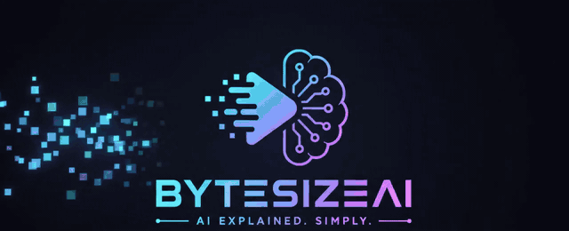

# Khushpreet Singh · AI Engineer

**Building things that think.** RAG · multi-agent systems · MCP · production LLM apps

---

## 👨‍💻 About

AI Engineer with ~2 years of production experience shipping LLM-powered products. I turn messy business problems into reliable AI systems: retrieval pipelines, agent workflows, and tool integrations that actually run in production.

## 🧠 What I build

- **RAG pipelines**: document ingestion, chunking, retrieval, evals
- **Multi-agent systems**: orchestration with LangGraph
- **MCP servers**: connecting LLMs to real tools and data
- **AI chatbots & workflow automation**: FastAPI backends, Dockerized deploys

## 🛠️ Tech stack

## 🚀 Featured projects

| Project | What it does | Stack |
|---|---|---|
| [**AgriGuide**](https://github.com/Kalrakhush/AgriGuide) | Recommends optimal crops from soil + weather data | Python, scikit-learn, Flask, React |
| **Document Chatbot** | Chat over budgetary & legal documents | Python, OpenAI, FastAPI, Streamlit, Docker |
| [**DecodeIPL**](https://github.com/Kalrakhush/DecodeIpl-An-IPL-Analysis-App-) | IPL analytics app | Python, Jupyter |

## 💼 Experience

- **Netsmartz** (Mohali): AI Engineer
- **DeepForrest AI**: built ETL pipelines on 10TB+ of data, deployed ML models for faster inference
- **CTRLS Datacenters / Suvidha Foundation**: predictive models and data pipelines (internships)

## 🎥 Bytesize AI on YouTube

**AI, explained simply.** Short, no-fluff videos on LLMs, agents and the tools shaping AI.

[▶️ Watch & subscribe](https://www.youtube.com/@bytesizeai)

## 📊 GitHub stats

---

<i>Open to AI engineering roles and freelance RAG / agent projects. Let's talk.</i>

